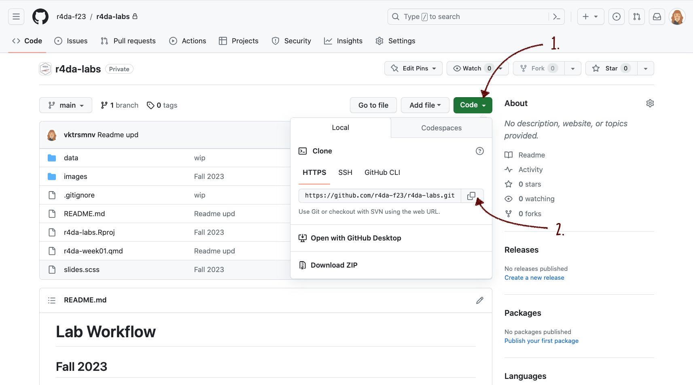
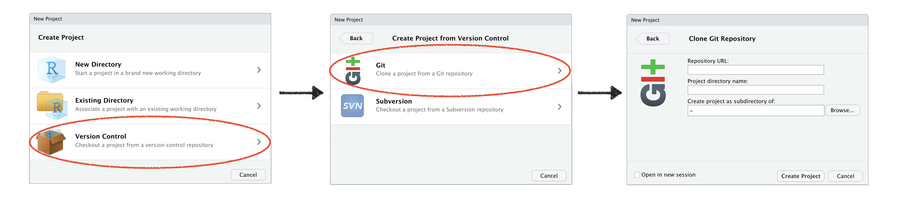

# Week 1: Meet the Toolkit 

## How to load the project into RStudio 

### 1. Get the URL of the repo 

Scroll to the top of the page. Click on the green `Code` button and copy the HTTPS link for the repo by clicking on the clipboard icon. 

### 2. Import the repository in RStudio

Open RStudio and select `File` > `New Project` > `Version Control` > `Git`. 

In the final window, paste the repo URL you grabbed from GitHub in the `Repository URL` window. 
Click on `Browse` to select the folder on your computer where you want to store the project. I suggest you set up a folder on your computer for all the class content and always use this as a destination to store your material for the course. 

Click on `Create Project`. 

If everything worked fine, you should now have a subfolder `week01_meet_the_toolkit` in the folder our selected when cloning the project. 
